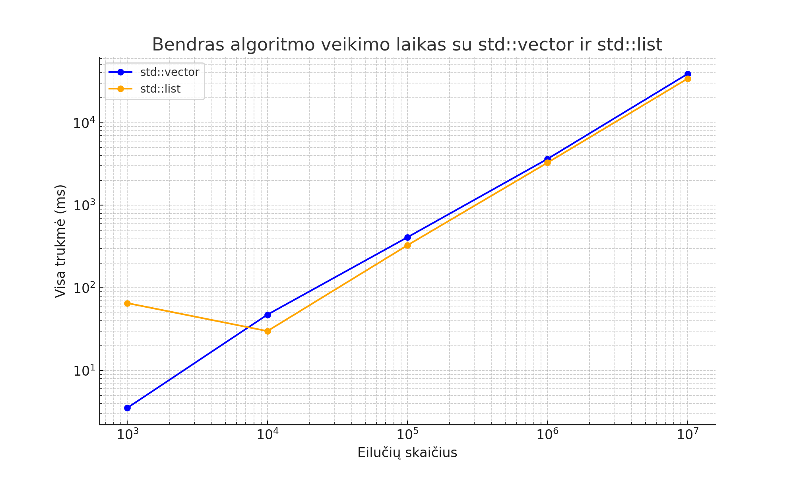
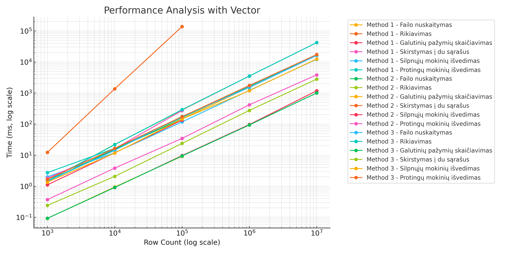
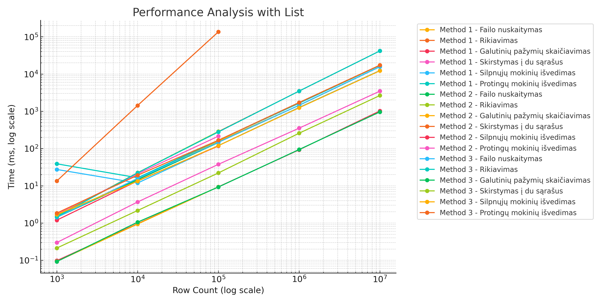

# oop-v1

Pagrindinis programos failas yra **main.cpp**

Procesorius: AMD Ryzen 5 6600H, 12 CPUs, ~3.3GHz

Atmintis: 16GB RAM

Kietas Diskas: SSD

# Algoritmo greičio palyginimas naudojant `std::vector` ir `std::list`

## Greičio eksperimentai naudojant `vector`

| Eilučių kiekis  | Failo nuskaitymas (ms) | Rikiavimas (ms) | Galutinių pažymių skaičiavimas (ms) | Skirstymas į du sąrašus (ms) | Silpnųjų mokinių išvedimas (ms) | Protingųjų mokinių išvedimas (ms) | Visa trukmė (ms) |
|-----------------|------------------------|-----------------|-------------------------------------|------------------------------|---------------------------------|-----------------------------------|------------------|
| 1000            | 0.935059               | 0.196684        | 0.034836                            | 0.113787                     | 0.910391                        | 1.34973                            | 3.5407           |
| 10000           | 7.3318                 | 7.20439         | 0.396134                            | 1.25571                      | 14.4801                         | 16.8448                            | 47.5134          |
| 100000          | 93.9962                | 41.5882         | 4.72499                             | 14.8127                      | 109.099                         | 145.986                            | 410.208          |
| 1000000         | 708.58                 | 527.017         | 33.2891                             | 116.225                      | 979.374                         | 1274.06                            | 3638.54          |
| 10000000        | 7500.52                | 6838.17         | 340.182                             | 1388.66                      | 9806.27                         | 13008.2                            | 38882            |

## Greičio eksperimentai naudojant `list`

| Eilučių kiekis  | Failo nuskaitymas (ms) | Rikiavimas (ms) | Galutinių pažymių skaičiavimas (ms) | Skirstymas į du sąrašus (ms) | Silpnųjų mokinių išvedimas (ms) | Protingųjų mokinių išvedimas (ms) | Visa trukmė (ms) |
|-----------------|------------------------|-----------------|-------------------------------------|------------------------------|---------------------------------|-----------------------------------|------------------|
| 1000            | 0.652371               | 0.043122        | 0.032883                            | 0.061497                     | 26.0982                         | 38.6205                            | 65.5087          |
| 10000           | 6.31865                | 0.501705        | 0.319447                            | 0.607966                     | 9.52224                         | 12.7733                            | 30.0434          |
| 100000          | 64.1822                | 8.99959         | 13.6393                             | 15.0855                      | 96.5232                         | 129.883                            | 328.314          |
| 1000000         | 710.011                | 106.716         | 33.9455                             | 114.931                      | 981.715                         | 1328.22                            | 3275.54          |
| 10000000        | 7363.2                 | 1481.16         | 573.688                             | 1411.18                      | 9568.22                         | 13653.7                            | 34051.2          |

# Greičio Eksperimentai

## Naudojant `vector`

| Eilučių skaičius | Dalinimo metodas | Failo nuskaitymas (ms) | Rikiavimas (ms) | Galutinių pažymių skaičiavimas (ms) | Skirstymas į du sąrašus (ms) | Silpnųjų mokinių išvedimas (ms) | Protingų mokinių išvedimas (ms) | Visa trukmė (ms) |
|------------------|------------------|-------------------------|-----------------|-------------------------------------|------------------------------|--------------------------------|-------------------------------|-------------------|
| 1000             | 1                | 1.7988                  | 1.47314         | 0.092366                            | 0.367959                     | 1.99289                       | 2.72783                      | 8.4541            |
| 1000             | 2                | 1.44981                 | 1.46884         | 0.091694                            | 12.2078                      | 1.10361                       | 1.79978                      | 18.1224           |
| 1000             | 3                | 1.43011                 | 1.47086         | 0.092085                            | 0.240156                     | 1.34829                       | 1.64423                      | 6.22648           |
| 10000            | 1                | 15.7371                 | 22.0396         | 0.907224                            | 3.82418                      | 11.9031                       | 16.4979                      | 70.9128           |
| 10000            | 2                | 15.3333                 | 21.9776         | 0.940567                            | 1357.14                      | 11.7911                       | 16.1209                      | 1423.31           |
| 10000            | 3                | 14.2701                 | 21.7197         | 0.911652                            | 2.06443                      | 11.6426                       | 16.544                       | 67.1546           |
| 100000           | 1                | 146.945                 | 283.635         | 9.62288                             | 34.4862                       | 117.157                       | 162.02                       | 753.87            |
| 100000           | 2                | 145.762                 | 279.876         | 9.18671                             | 137286                        | 133.297                       | 269.541                      | 138124            |
| 100000           | 3                | 176.044                 | 289.916         | 9.36294                             | 23.7894                       | 144.412                       | 172.422                      | 815.951           |
| 1000000          | 1                | 1535.33                 | 3511.45         | 96.3739                             | 416.453                       | 1211.47                       | 1647.83                      | 8418.92           |
| 1000000          | 2                | duomenu nera            | duomenu nera    | duomenu nera                         | duomenu nera                  | duomenu nera                   | duomenu nera                  | duomenu nera      |
| 1000000          | 3                | 1497.55                 | 3510.63         | 93.4055                             | 274.824                       | 1187.11                       | 1746.56                      | 8310.08           |
| 10000000         | 1                | 16660.8                 | 41889.4         | 1179.72                             | 3836.15                       | 12191.2                       | 16772.6                      | 92529.9           |
| 10000000         | 2                | duomenu nera            | duomenu nera    | duomenu nera                         | duomenu nera                  | duomenu nera                   | duomenu nera                  | duomenu nera      |
| 10000000         | 3                | 16139.4                 | 41899.1         | 1001.22                             | 2789.63                       | 12459.2                       | 17268.1                      | 91556.6           |

## Naudojant `list`

| Eilučių skaičius | Dalinimo metodas | Failo nuskaitymas (ms) | Rikiavimas (ms) | Galutinių pažymių skaičiavimas (ms) | Skirstymas į du sąrašus (ms) | Silpnųjų mokinių išvedimas (ms) | Protingų mokinių išvedimas (ms) | Visa trukmė (ms) |
|------------------|------------------|-------------------------|-----------------|-------------------------------------|------------------------------|--------------------------------|-------------------------------|-------------------|
| 1000             | 1                | 1.47366                 | 1.55667         | 0.097886                            | 0.299579                     | 27.405                        | 38.8655                      | 69.7             |
| 1000             | 2                | 1.42399                 | 1.5353          | 0.093137                            | 13.4709                      | 1.19732                       | 1.73317                      | 19.4547          |
| 1000             | 3                | 1.42725                 | 1.47914         | 0.092456                            | 0.213195                     | 1.69755                       | 1.84964                      | 6.75995          |
| 10000            | 1                | 15.5905                 | 22.3919         | 0.958691                            | 3.67656                      | 11.8596                       | 16.4267                      | 70.9059          |
| 10000            | 2                | 14.5511                 | 22.3214         | 0.939394                            | 1428.61                      | 13.5117                       | 20.8514                      | 1500.79          |
| 10000            | 3                | 15.7396                 | 22.2698         | 1.05664                             | 2.16797                      | 13.3169                       | 19.1805                      | 73.7339          |
| 100000           | 1                | 156.191                 | 284.235         | 9.35549                             | 37.6463                      | 120.057                       | 166.609                      | 774.098          |
| 100000           | 2                | 144.784                 | 286.921         | 9.35724                             | 135476                       | 116.847                       | 214.524                      | 136248           |
| 100000           | 3                | 146.603                 | 278.773         | 9.25836                             | 22.0883                      | 119.334                       | 166.795                      | 742.855          |
| 1000000          | 1                | 1441.63                 | 3478           | 92.5793                             | 352.352                      | 1266.19                       | 1646.97                      | 8277.73          |
| 1000000          | 2                | duomenu nera            | duomenu nera    | duomenu nera                         | duomenu nera                  | duomenu nera                   | duomenu nera                  | duomenu nera      |
| 1000000          | 3                | 1453.41                 | 3493.92         | 94.0017                             | 257.948                      | 1242.03                       | 1718.49                      | 8259.81          |
| 10000000         | 1                | 15693.7                 | 41786.1         | 1021.66                             | 3468.51                      | 12397.8                       | 17020                        | 91387.7          |
| 10000000         | 2                | duomenu nera            | duomenu nera    | duomenu nera                         | duomenu nera                  | duomenu nera                   | duomenu nera                  | duomenu nera      |
| 10000000         | 3                | 15698.5                 | 41772.2         | 961.357                             | 2648.32                      | 12228.7                       | 17312.7                      | 90621.8          |

## Diagramos

### Vektoriaus diagrama

### Saraso diagrama

